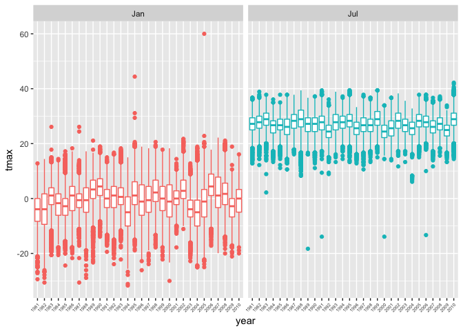
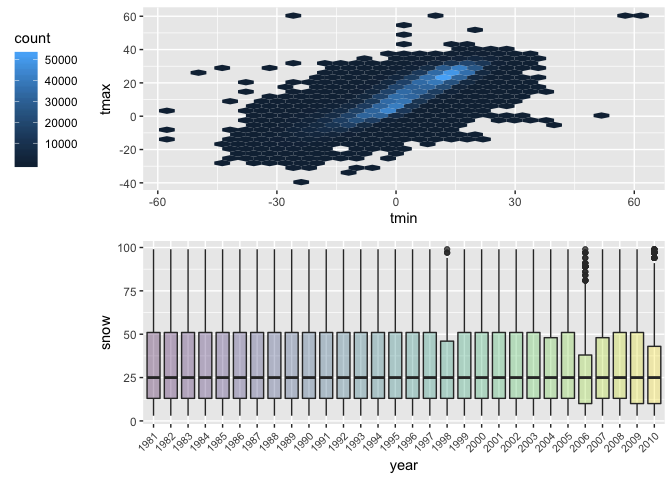

P8105\_hw3\_ykk2116
================
Yaa Klu
10/10/2018

*Loading
    tidyverse*

``` r
library(tidyverse)
```

    ## ── Attaching packages ────────────────────────────────────────────── tidyverse 1.2.1 ──

    ## ✔ ggplot2 3.0.0     ✔ purrr   0.2.5
    ## ✔ tibble  1.4.2     ✔ dplyr   0.7.6
    ## ✔ tidyr   0.8.1     ✔ stringr 1.3.1
    ## ✔ readr   1.1.1     ✔ forcats 0.3.0

    ## ── Conflicts ───────────────────────────────────────────────── tidyverse_conflicts() ──
    ## ✖ dplyr::filter() masks stats::filter()
    ## ✖ dplyr::lag()    masks stats::lag()

``` r
library(ggthemes)
library(patchwork)
library(hexbin)
library(chron)
```

### Problem 1

*Loading BRFSS
    dataset*

``` r
devtools::install_github("p8105/p8105.datasets")
```

    ## Skipping install of 'p8105.datasets' from a github remote, the SHA1 (21f5ad1c) has not changed since last install.
    ##   Use `force = TRUE` to force installation

``` r
library(p8105.datasets)

data(brfss_smart2010)
```

*Cleaning of dataset and selection of variables*

``` r
brfss_df = janitor::clean_names(dat = brfss_smart2010) %>%
  filter(topic == "Overall Health") %>%
  mutate(response = forcats::fct_relevel(response, c("Excellent", "Very good", "Good", "Fair", "Poor")))
```

select(-(class:question), -sample\_size,
-(confidence\_limit\_low:geo\_location)) %\>% *States that were observed
at 7 locations*

``` r
brfss_df %>%
  filter(year == 2002) %>%
  group_by(locationabbr) %>%
  distinct(locationdesc) %>%
  summarise(n = n()) %>%
  filter( n == 7) %>%
  knitr::kable()
```

| locationabbr | n |
| :----------- | -: |
| CT           | 7 |
| FL           | 7 |
| NC           | 7 |

*Spaghetti plot* number of locations in each state

``` r
brfss_df %>%
  distinct(locationabbr, locationdesc, year) %>% 
  group_by(locationabbr, year) %>%
  summarise(number_of_locations = n()) %>%
  ggplot(aes(x = year, y = number_of_locations, color = locationabbr)) +
  geom_line() +
labs(
  title = "Spaghetti Plot",
  x = "Year",
  y = "Number of Locations Observed",
  caption = "BRFSS 2010 Data"
)
```

<!-- -->

``` r
scale_x_continuous(breaks = c(2002, 2003, 2004, 2005, 2006, 2007, 2008, 2009, 2010))
```

    ## <ScaleContinuousPosition>
    ##  Range:  
    ##  Limits:    0 --    1

*Making of Table*

``` r
brfss_df %>%
  filter(year %in% c(2002, 2006, 2010)) %>%
  filter(locationabbr == "NY") %>%
  spread(key = response, value = data_value) %>% 
  janitor::clean_names(dat = .) %>% 
  group_by(locationabbr, year) %>%
  summarise(n = n(),
        mean = mean(excellent, na.rm = TRUE),
        sd = sd(excellent, na.rm = TRUE)) %>%
  knitr::kable()
```

| locationabbr | year |  n |     mean |       sd |
| :----------- | ---: | -: | -------: | -------: |
| NY           | 2002 | 25 | 24.04000 | 4.486424 |
| NY           | 2006 | 30 | 22.53333 | 4.000833 |
| NY           | 2010 | 45 | 22.70000 | 3.567212 |

``` r
average_brfss =
  brfss_df %>%
  group_by(locationabbr, year, response) %>%
  summarise(average = mean(data_value, na.rm = TRUE))


average_brfss %>%
  ggplot(aes(x = factor(year), y = average)) +
  geom_violin(aes(fill = factor(response))) +
  facet_grid(.~response) +
  stat_summary(fun.y = median, geom = "point", size = 0.5) +
  labs(
     title = "Number of items ordered in each aisle",
    x = "Aisle",
    y = "Frequency of orders",
    caption = "Data from 2017 Instacart Online Grocery Shopping"
  ) +
  scale_fill_discrete(name = "response") +
  theme(axis.text.x = element_text(angle = 45, hjust = 1))
```

<!-- -->

### Problem 2

*Loading Dataset*

``` r
data("instacart")
```

*Number of aisles and which aisles most items are ordered from*

``` r
instacart %>%
  distinct(aisle_id) %>%
  count()
```

    ## # A tibble: 1 x 1
    ##       n
    ##   <int>
    ## 1   134

``` r
instacart %>%
  group_by(aisle_id, aisle) %>%
  summarise(number = n()) %>%
  ungroup() %>%
  top_n(5, number) %>%
  arrange(desc(number)) %>%
  knitr::kable()
```

| aisle\_id | aisle                      | number |
| --------: | :------------------------- | -----: |
|        83 | fresh vegetables           | 150609 |
|        24 | fresh fruits               | 150473 |
|       123 | packaged vegetables fruits |  78493 |
|       120 | yogurt                     |  55240 |
|        21 | packaged cheese            |  41699 |

*Plot that shows the number of items ordered in each aisle*

``` r
instacart %>%
  group_by(aisle_id, aisle) %>%
  summarise(number = n()) %>%
  arrange(desc(number)) %>%
  mutate(asile = tools::toTitleCase(aisle)) %>%
  ggplot(aes(x = reorder(aisle, -number), y = number, fill = aisle)) +
  geom_col() +
  theme(axis.title.x = element_text(angle = 45, hjust = 1, size = 6),
        legend.position = "none") +
  labs(
    title = "Number of items ordered in each aisle",
    x = "Aisle",
    y = "Frequency of orders",
    caption = "Data from 2017 Instacart Online Grocery Shopping"
  ) +
coord_flip()
```

<!-- -->

*Table showing the most popular item in each of the aisles “baking
ingredients”, “dog food care”, and “packaged vegetables fruits”*

``` r
instacart %>%
  select(aisle_id, aisle, product_id, product_name) %>%
  filter(aisle == "baking ingredients" | aisle == "dog food care" | aisle == "packaged vegetables fruits") %>%
  group_by(aisle, product_name) %>%
  summarise(number = n()) %>%
  top_n(1, number) %>%
  arrange(desc(number)) %>%
  knitr::kable()
```

| aisle                      | product\_name                                 | number |
| :------------------------- | :-------------------------------------------- | -----: |
| packaged vegetables fruits | Organic Baby Spinach                          |   9784 |
| baking ingredients         | Light Brown Sugar                             |    499 |
| dog food care              | Snack Sticks Chicken & Rice Recipe Dog Treats |     30 |

*Table showing the mean hour of the day at which Pink Lady Apples and
Coffee Ice Cream are ordered on each day of the week*

``` r
instacart %>%
  filter(product_name == "Pink Lady Apples" | product_name == "Coffee Ice Cream") %>%
group_by(order_dow, product_name) %>% 
  summarise(mean_hour = mean(order_hour_of_day)) %>% 
  spread(key = order_dow, value = mean_hour) %>% 
  knitr::kable()
```

| product\_name    |        0 |        1 |        2 |        3 |        4 |        5 |        6 |
| :--------------- | -------: | -------: | -------: | -------: | -------: | -------: | -------: |
| Coffee Ice Cream | 13.77419 | 14.31579 | 15.38095 | 15.31818 | 15.21739 | 12.26316 | 13.83333 |
| Pink Lady Apples | 13.44118 | 11.36000 | 11.70213 | 14.25000 | 11.55172 | 12.78431 | 11.93750 |

### Problem 3

*Loading dataset*

``` r
data("ny_noaa")
```

``` r
noaa_df = ny_noaa %>% 
  mutate(month = months.Date(date, abbreviate = TRUE),
         day = chron::days(date),
         year = chron::years(date),
         tmax = (as.numeric(tmax))/10,
         tmin = (as.numeric(tmin))/10,
         prcp = prcp/10)
```

``` r
noaa_df %>% 
  group_by(snow) %>% 
  summarise(number = n()) %>% 
  arrange(desc(number))
```

    ## # A tibble: 282 x 2
    ##     snow  number
    ##    <int>   <int>
    ##  1     0 2008508
    ##  2    NA  381221
    ##  3    25   31022
    ##  4    13   23095
    ##  5    51   18274
    ##  6    76   10173
    ##  7     8    9962
    ##  8     5    9748
    ##  9    38    9197
    ## 10     3    8790
    ## # ... with 272 more rows

``` r
noaa_df %>% 
  group_by(id, year, month) %>% 
  summarize(n = n(),
            sum = sum(tmax, na.rm = TRUE),
            mean = mean(tmax, na.rm = TRUE)) %>% 
  filter(month %in% c("Jan", "Jul")) %>% 
  ggplot(aes(x = year, y = mean, color = month)) +
  facet_grid(~month) + 
  geom_point() +
  theme(legend.position = "none", 
        axis.text.x = element_text(angle = 45, hjust = 1, size = 5)) +
  viridis::scale_color_viridis(
    name = "Location", 
    discrete = TRUE) 
```

    ## Warning: Removed 5970 rows containing missing values (geom_point).

<!-- -->

*extent of NA*

``` r
sum_na = sapply(noaa_df, function(x) sum(is.na(x)))
prop_na = sapply(noaa_df, function(x) sum(is.na(x)/nrow(noaa_df)))
rbind(sum_na, prop_na) %>% knitr::kable(digits = 2)
```

|          | id | date |      prcp |      snow |      snwd |       tmax |       tmin | month | day | year |
| -------- | -: | ---: | --------: | --------: | --------: | ---------: | ---------: | ----: | --: | ---: |
| sum\_na  |  0 |    0 | 145838.00 | 381221.00 | 591786.00 | 1134358.00 | 1134420.00 |     0 |   0 |    0 |
| prop\_na |  0 |    0 |      0.06 |      0.15 |      0.23 |       0.44 |       0.44 |     0 |   0 |    0 |

*Average max temperature in January and in July in each station across
years*

``` r
noaa_df %>% 
  filter(month %in% c("Jan", "Jul")) %>% 
  ggplot(aes(x = year, y = tmax, color = month)) +
  facet_grid(~month) +
  geom_boxplot() +
  theme(legend.position = "none", 
        axis.text.x = element_text(angle = 45, hjust = 1, size = 5))
```

    ## Warning: Removed 190331 rows containing non-finite values (stat_boxplot).

<!-- -->

``` r
my_hex = ggplot(noaa_df, aes(x = tmin, y = tmax)) +
  geom_hex(aes()) +
  theme(legend.position = "left")
        
my_boxes = noaa_df %>% 
  filter(snow > 0 & snow < 100) %>% 
  ggplot(aes(x = year, y = snow, fill = year)) +
  geom_boxplot(alpha = 0.3) +
  theme(legend.position = "none", 
        axis.text.x = element_text(angle = 45, hjust = 1, size = 7))

my_hex / my_boxes
```

    ## Warning: Removed 1136276 rows containing non-finite values (stat_binhex).

<!-- -->
