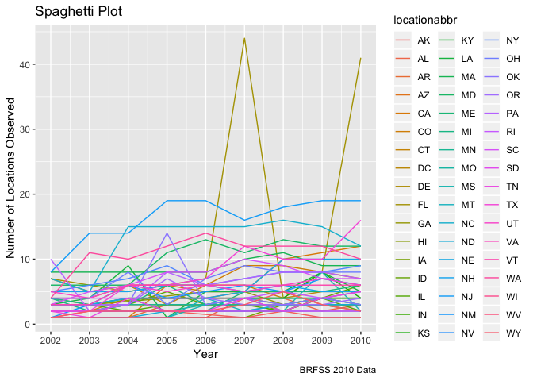
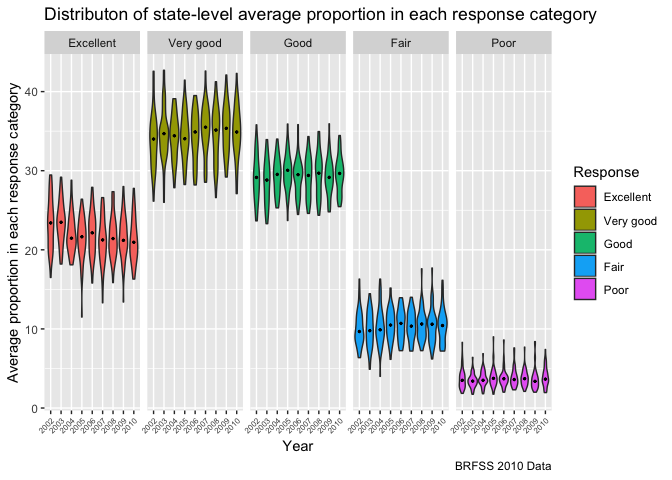

P8105\_hw3\_ykk2116
================
Yaa Klu
10/10/2018

*Loading
    tidyverse*

``` r
library(tidyverse)
```

    ## ── Attaching packages ─────────────────────────────────────────────── tidyverse 1.2.1 ──

    ## ✔ ggplot2 3.0.0     ✔ purrr   0.2.5
    ## ✔ tibble  1.4.2     ✔ dplyr   0.7.6
    ## ✔ tidyr   0.8.1     ✔ stringr 1.3.1
    ## ✔ readr   1.1.1     ✔ forcats 0.3.0

    ## ── Conflicts ────────────────────────────────────────────────── tidyverse_conflicts() ──
    ## ✖ dplyr::filter() masks stats::filter()
    ## ✖ dplyr::lag()    masks stats::lag()

``` r
library(patchwork)
library(hexbin)
library(ggthemes)
```

### Problem 1

*Loading BRFSS
    dataset*

``` r
devtools::install_github("p8105/p8105.datasets")
```

    ## Skipping install of 'p8105.datasets' from a github remote, the SHA1 (21f5ad1c) has not changed since last install.
    ##   Use `force = TRUE` to force installation

``` r
library(p8105.datasets)

data(brfss_smart2010)
```

*Cleaning of BRFSS dataset and selection of variables*

``` r
brfss_df = janitor::clean_names(dat = brfss_smart2010) %>%
  filter(topic == "Overall Health") %>%
  mutate(response = forcats::fct_relevel(response, c("Excellent", "Very good", "Good", "Fair", "Poor")))
```

*States that were observed at 7 locations*

``` r
brfss_df %>%
  filter(year == 2002) %>%
  group_by(locationabbr) %>%
  distinct(locationdesc) %>%
  summarise(n = n()) %>%
  filter( n == 7) %>%
  knitr::kable(digits = 2)
```

| locationabbr | n |
| :----------- | -: |
| CT           | 7 |
| FL           | 7 |
| NC           | 7 |

\*\* According to the table above, in 2002, the states of CT, FL, NC
were observed at 7 locations.\*\*

*Spaghetti plot that shows the number of locations in each state from
2002 to 2010*

``` r
brfss_df %>%
  distinct(locationabbr, locationdesc, year) %>% 
  group_by(locationabbr, year) %>%
  summarise(number_of_locations = n()) %>%
  ggplot(aes(x = year, y = number_of_locations, color = locationabbr)) +
  geom_line() +
scale_x_continuous(breaks = c(2002, 2003, 2004, 2005, 2006, 2007, 2008, 2009, 2010)) +
labs(
  title = "Spaghetti Plot",
  x = "Year",
  y = "Number of Locations Observed",
  caption = "BRFSS 2010 Data"
)
```

<!-- -->

**Looking at the plot above, we can see that majority of the states
showed a similar trend in the number of locations across all the years.
However, for one of the states, there was a huge spike or increase from
2006 to 2007 and it decreased again in 2008. However there was another
increase from 2009 to 2010. The particular state is hard to identify as
it is.**

*Table that shows the mean and standard deviation of the “excellent”
responses across locations in NY state for 2002, 2006 and 2010*

``` r
brfss_df %>%
  filter(year %in% c(2002, 2006, 2010)) %>%
  filter(locationabbr == "NY") %>%
  spread(key = response, value = data_value) %>% 
  janitor::clean_names(dat = .) %>% 
  group_by(locationabbr, year) %>%
  summarise(n = n(),
        mean = mean(excellent, na.rm = TRUE),
        sd = sd(excellent, na.rm = TRUE)) %>%
  knitr::kable(digits = 2)
```

| locationabbr | year |  n |  mean |   sd |
| :----------- | ---: | -: | ----: | ---: |
| NY           | 2002 | 25 | 24.04 | 4.49 |
| NY           | 2006 | 30 | 22.53 | 4.00 |
| NY           | 2010 | 45 | 22.70 | 3.57 |

**In the table above, we can see that the number of variables (N)
increased through 2002 to 2010; from 25 in 2002, 30 in 2006 and to 45 in
2010. The mean in 2002 was different from the means in 2006 and 2010;
the mean for 2006 and 2010 were similar. The standard deviation was
highest in 2002 and it was lower in 2006 and lowest in 2010.**

*A five-panel violin plot that shows, for each response category
separately, the distribution of state-level averages (average proportion
in each response category) over time*

``` r
average_brfss =
  brfss_df %>%
  group_by(locationabbr, year, response) %>%
  summarise(average = mean(data_value, na.rm = TRUE))


average_brfss %>%
  ggplot(aes(x = factor(year), y = average)) +
  geom_violin(aes(fill = factor(response))) +
  facet_grid(.~response) +
  stat_summary(fun.y = median, geom = "point", size = 0.5) +
  labs(
     title = "Distributon of state-level average proportion in each response category",
    x = "Year",
    y = "Average proportion in each response category",
    caption = "BRFSS 2010 Data"
  ) +
  scale_fill_discrete(name = "Response") +
  theme(axis.text.x = element_text(angle = 45, size = 6, hjust = 1))
```

<!-- -->

**According to the violin plot above, overall, the average responses
across the years increases in the following order across the type of
response: POOR, FAIR, EXCELLENT, GOOD and VERY GOOD. It makes sense that
average poor health response would be the lowest and that of very good
would be the highest. Also, I would say the varaibilities observed
within each response category across the years were somewhat similar;
however more variability was seen in EXECELENT and VERY GOOD
categories**

### Problem 2

*Loading Instacart Dataset*

``` r
data("instacart")
```

*Description of data*

**The instacart dataset has 1384617 observations and 1384617 variables.
The variable order\_id is a unique identifier of the orders made. The
number of unique orders are 1384617. There are 131209 unique customers.
The variables department\_name, product\_name, and aisle have
corresponding unique identifiers. The variable order\_dow represents the
day of the week orders were made and the order\_hour\_of\_day represents
the time or hour of day orders were made.**

*Number of aisles and which aisles most items are ordered from*

``` r
instacart %>%
  distinct(aisle_id) %>%
  count()
```

    ## # A tibble: 1 x 1
    ##       n
    ##   <int>
    ## 1   134

``` r
instacart %>%
  group_by(aisle_id, aisle) %>%
  summarise(number = n()) %>%
  ungroup() %>%
  top_n(10, number) %>%
  arrange(desc(number)) %>%
  knitr::kable(digits = 2)
```

| aisle\_id | aisle                         | number |
| --------: | :---------------------------- | -----: |
|        83 | fresh vegetables              | 150609 |
|        24 | fresh fruits                  | 150473 |
|       123 | packaged vegetables fruits    |  78493 |
|       120 | yogurt                        |  55240 |
|        21 | packaged cheese               |  41699 |
|       115 | water seltzer sparkling water |  36617 |
|        84 | milk                          |  32644 |
|       107 | chips pretzels                |  31269 |
|        91 | soy lactosefree               |  26240 |
|       112 | bread                         |  23635 |

**From the output above, there are 134 aisles. Also, the output shows
the top ten most popular aisles, with the top being fresh vegetables
aisles.**

*Bar plot that shows the number of items ordered in each aisle*

``` r
instacart %>%
  group_by(aisle_id, aisle) %>%
  summarise(number = n()) %>%
  arrange(desc(number)) %>%
  mutate(asile = tools::toTitleCase(aisle)) %>%
  ggplot(aes(x = reorder(aisle, -number), y = number, fill = aisle)) +
  geom_col() +
  theme(axis.title.x = element_text(angle = 45, hjust = 1, size = 6),
        legend.position = "none") +
  labs(
    title = "Number of items ordered in each aisle",
    x = "Aisle",
    y = "Frequency of orders",
    caption = "Data from 2017 Instacart Online Grocery Shopping"
  ) +
coord_flip()
```

<!-- -->

**The barplot shows the number of times ordered in each aisle and the
highest number of items ordered were ordered from the aisles which
corresponds to what was previously observed as the 10 most popular
aisles. Most items were ordered from the fresh vegetables aisle.**

*Table showing the most popular item in each of the aisles “baking
ingredients”, “dog food care”, and “packaged vegetables fruits”*

``` r
instacart %>%
  select(aisle_id, aisle, product_id, product_name) %>%
  filter(aisle == "baking ingredients" | aisle == "dog food care" | aisle == "packaged vegetables fruits") %>%
  group_by(aisle, product_name) %>%
  summarise(number = n()) %>%
  top_n(1, number) %>%
  arrange(desc(number)) %>%
  knitr::kable(digits = 2)
```

| aisle                      | product\_name                                 | number |
| :------------------------- | :-------------------------------------------- | -----: |
| packaged vegetables fruits | Organic Baby Spinach                          |   9784 |
| baking ingredients         | Light Brown Sugar                             |    499 |
| dog food care              | Snack Sticks Chicken & Rice Recipe Dog Treats |     30 |

**From the table above, the most popular item in the “packaged
vegetables fruits” is Organic Baby Spinach“, that for”Baking
Ingredients" is Light Brown Sugar and that for “dog food care” is Snack
Sticks Chicken & Rice Recipe Dog Treats. Also, the numbers were in
descreasing order: spinach, brown sugar and dog treats.**

*Table showing the mean hour of the day at which Pink Lady Apples and
Coffee Ice Cream are ordered on each day of the week*

``` r
instacart %>%
  filter(product_name == "Pink Lady Apples" | product_name == "Coffee Ice Cream") %>%
group_by(order_dow, product_name) %>% 
  summarise(mean_hour = mean(order_hour_of_day)) %>% 
  spread(key = order_dow, value = mean_hour) %>% 
  knitr::kable(digits = 2)
```

| product\_name    |     0 |     1 |     2 |     3 |     4 |     5 |     6 |
| :--------------- | ----: | ----: | ----: | ----: | ----: | ----: | ----: |
| Coffee Ice Cream | 13.77 | 14.32 | 15.38 | 15.32 | 15.22 | 12.26 | 13.83 |
| Pink Lady Apples | 13.44 | 11.36 | 11.70 | 14.25 | 11.55 | 12.78 | 11.94 |

**From the output above, for the 1st and 6th day of the week, the mean
hour of the day for which the 2 products are ordered are similar.
However for the rest of the week, the mean hour is later for Coffee Ice
Cream, suggesting that people order the ice-cream at a much later time
in the day.**

### Problem 3

*Loading nynoaa dataset*

``` r
data("ny_noaa")
```

*Data cleaning*

``` r
noaa_df = ny_noaa %>% 
  mutate(month = months.Date(date, abbreviate = TRUE),
         day = chron::days(date),
         year = chron::years(date),
         tmax = (as.numeric(tmax))/10,
         tmin = (as.numeric(tmin))/10,
         prcp = prcp/10)
```

*Short description of data*

**The dataset has 2595176 observations and 10 variables. The dataset
also contains 747 unique stations that recorded weather information from
the years 1981 to 2010. There are variables that also has information on
precipitation (prcp), maximum and minimum temperature (tmax and tmin)
and snow fall(snow) and snow depth (snwd).**

``` r
noaa_df %>% 
  group_by(snow) %>% 
  summarise(number = n()) %>% 
  arrange(desc(number))
```

    ## # A tibble: 282 x 2
    ##     snow  number
    ##    <int>   <int>
    ##  1     0 2008508
    ##  2    NA  381221
    ##  3    25   31022
    ##  4    13   23095
    ##  5    51   18274
    ##  6    76   10173
    ##  7     8    9962
    ##  8     5    9748
    ##  9    38    9197
    ## 10     3    8790
    ## # ... with 272 more rows

**For snowfall, the most commonly observed values are 0 and NA. This is
probably due to the fact that most days of the year there is no
snowfall. Additionally, there might have been stations that may not have
any records of snow due to technical difficulties in recording or
perhaps they do not record any snowfall even if there are snow days.**

*A two-panel plot showing the average max temperature in January and in
July in each station across years*

``` r
noaa_df %>% 
  filter(month %in% c("Jan", "Jul")) %>% 
  ggplot(aes(x = year, y = tmax, color = month)) +
  facet_grid(~month) +
  geom_boxplot() +
  theme(legend.position = "none", 
        axis.text.x = element_text(angle = 45, hjust = 1, size = 5))
```

    ## Warning: Removed 190331 rows containing non-finite values (stat_boxplot).

<!-- -->

**Looking at the plot above, generally the average temperatures were
higher in July, compared to January, although there were some very few
outliers recorded for both months. It is expected that average
temperatures are higher in July**

*A two-panel plot showing (i) tmax vs tmin for the full dataset and (ii)
make a plot showing the distribution of snowfall values greater than 0
and less than 100 separately by year*

``` r
my_hex = ggplot(noaa_df, aes(x = tmin, y = tmax)) +
  geom_hex(aes()) +
  theme(legend.position = "left")
        
my_boxes = noaa_df %>% 
  filter(snow > 0 & snow < 100) %>% 
  ggplot(aes(x = year, y = snow, fill = year)) +
  geom_boxplot(alpha = 0.3) +
  theme(legend.position = "none", 
        axis.text.x = element_text(angle = 45, hjust = 1, size = 7))

my_hex / my_boxes
```

    ## Warning: Removed 1136276 rows containing non-finite values (stat_binhex).

<!-- -->

**The hexagonal heat map shows the distribution (count) of the pairs of
tmax and tmin. The box plot, shows that there are more variability in
snowfall in the last ten years compared to first ten years.
Additionally, we can see that, there are more outliers in the last ten
years.**
